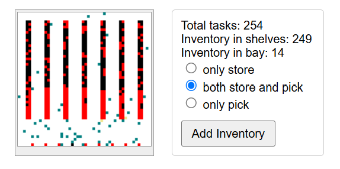

# Robotic Warehouse: a sketch

This is a sketch of a robotic warehouse simulator.

# The idea

We want to have a simulated robotic warehouse, to be able to compare different kinds of pathfinding algorithms for robots working in this warehouse. We'll have only one type of a robot, each robot occupying one pixel on a square grid. These robots can move around, carry items, and pick and store them in either racks or loading bays at one side of the warehouse. Items are identified by their unique string codes.

The peculiar vibe of this sketch in particular is that we want to land half-way between a realistic system design (with microservices, independent robots, asynchronous communications via message queues and stacks etc.) and a (relatively) efficient simulation environment. Eventually, we want to be able to run tests, and compare different pathfinding strategies and algorithms. Because of that indended use, some aspects of the system will be radically simplified (like for example, that robots are just pixels on a grid), while others may look slightly overengineered. We won't try to vectorize movementsof robots: even though it would make the calculations faster, it would introduce too much cognitive load, and make supporting this system harder in the long-term. For example, we'll treat robots as entities that are making decisions of their own, and we'll try to compartmentalize all of this logic into their own class (even though externalizing it and vectorizing the movements would have been faster). But at the same time, we'll have a bunch of pseudo-global varibles (most notably, in a singleton Universe class), and we won't protect states of objects in this universe with getters and setters, instead exposing them directly, to preserve some pythonicity. So a robot will be able to reach directly to the rack via something like `self.universe.shelves.inventory`, which _is_ risky, but will make the code simpler and more concise. It's a mixed approach ;)

# Running the project

Clone the repo. Run `/src/robowh/main.py`. In a browser, run `http://localhost:5000/`.

To mess with the stuff, clone and install it as a package with `pip install -e .`.

# Architecture overview

The system consists of several units:
1. **GUI** - a front-end, vibe-coded in JS, talking to a flask backend
2. **View** - a Flask backend responding to requests from the Visualizer
3. **Universe** - a global singleton object that also serves as a time-engine, orchestrating time-ticks. In a real physical WH robots would move around on their own and communicate with the orchestrator asynchronously. In this model however we have a Universe engine that nudges other players (both microservices and robots) one by one, allowing them to perform certan actions. It's not true concurrency, but for this purpose it's good enough. To simulate concurrency, robots are nudged (given priority) in random order. Each "turn" (time tick) takes a fixed amount of time, and once this time is up, remaining robots are not given priority, simulating a compute bottleneck. Other system operations (Orchestrator, Observer) are always given their part of compute however, to make sure the system keeps running.
4. **Orchestrator** - the main logic of the warehouse: coordinating storage locations, assigning tasks to robots. IRL it would receive orders from the Scheduler, but we have cut some corners, and instead robots are moving all the time, with new orders created "on the fly" the moment a robot completed its previous task.
5. **Robots** - each robot is an object that interfaces with the Universe (on movement and other robot-driven actions) and with the Orchestrator (getting tasks from it, and reporting back).
6. **Strategies** - abstracted pathfinding methods that for a given start and end points calculate a given number of steps in the direction of this point
6. **Observer** - collects diagnostic information about the state of the system.
7. **Scheduler** - acts as an external interface of the warehouse. Not really used in this project, at least for now.

The ontology of behaviors:
* Orders - normally would come "from the exernal world" and placed in a queue by the Scheduler. Not used for now, but are mentioned every now and then, as a concept.
* Tasks - are assigned to robots by the Orchestrator. IRL Orchestrator would read them from a queue populated by scheduler. In this model, the Ochestrator generates tasks itself (at least for now). A typical task sounds like "Bring product A from loading bay 2 to shelf position 101", and may in principle include preparation and postprocesssing steps.
* Actions - most tasks consist of several actions, a typical task for a typical robot is broken into at least 4 tasks: come to A, pick an order, move to B, drop an order.
* A queue of planned next elementary moves- a part of a planned motion, generated by a staregy, according to the current action
* Individual move - up down left right

One weird semantic issue is that movements of robots may happen at several different levels of organization. So let's try to use different words for this. It's not an ideal list of course, but better than nothing haha:
* A task that is movement-only will be called `reposition`
* An action within a task that is about moving from A to B will be called `go`
* A sequence of next elementary steps is called `next_moves`
* Finally, elementary moves are performed by a method `move()`

# Next steps

TODO:
* Count the number of robots that were processed (didn't time out), show it in the console
* Add n tasks processed per second
* Measure and report confusins and blockage for robots, percent of time blocked
* Add buttons for adding robots and removing robots
* Improve unit test for robots, as towards the end it seems to be making strange assumptions
* Make "confused" element in UI actually report the number of confused robots

Nice to haves:
* Actually support `mypy`. For now typehints are mostly for my own visual benefit, the most common violation being setting a non-optional field to None.
* Move orders creation logic to the scheduler?
* Make robots remember what they carry (or None), and check that at loading/unloading
* Unit tests for shelves utility functions (locking, random elements)
* Unit test for Universe `.scan()`
* Revise the singleton situation. The handling of sigletons is still a bit awkward: Universe is the only true singleton, and it creates others, except for the viewer, that is created in the main script. But also, to most (except for robots), universe is passed as a parameter, while for robots we break circular references using a deferred import (ugly). How to best standardize this? Should we always pass a reference to the universe explicitly at object creation, or is there a better way?